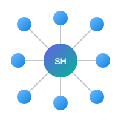

<p align="center">
  
</p>

<p align="center">
  
</p>

<p align="center">
  <a href="README.zh-CN.md">中文文档</a> · <a href="#quick-start">Quick Start</a> · <a href="#commands">Commands</a> · <a href="#how-it-works">How It Works</a>
</p>

<p align="center">
  
  
  
  
</p>

---

One central repository. Every AI agent reads from it through junctions. No daemons, no background services — just run `skillhome sync` when you need it.

## The Problem

You use Codex, Devin, Claude Code, Windsurf, Cursor, Gemini — each has its own skill directory. Skills you install in one agent don't appear in others. You copy them manually. When a skill updates, copies go stale. Junctions break. You lose track of which version lives where.

## The Solution

SkillHome moves all skill files into a single central repository (`~/.skillhome/skills/`), then replaces each agent's skill directory entries with NTFS junctions pointing back to the center.

```
                    ┌─────────────────────────────────────────┐
                    │         ~/.skillhome/skills/             │
                    │         (Central Repository)             │
                    │                                         │
                    │   crux/  architect-prompts/  docx/  ...  │
                    └──────────────┬──────────────────────────┘
                                   │
              ┌────────┬───────────┼───────────┬────────┐
              │        │           │           │        │
              ▼        ▼           ▼           ▼        ▼
         .codex/    .devin/    .claude/   .cursor/  .gemini/
         skills/    skills/    skills/    skills/   skills/
              │        │           │           │        │
           junction  junction  junction  junction  junction
```

Each agent sees its own skill directory as if nothing changed. The files are real, readable, and behave exactly like local directories. But they all point to one source of truth.

## Quick Start

```powershell
# 1. Initialize — auto-discovers all skill directories on your machine
skillhome init

# 2. Sync — migrates skills to central repo, creates junctions
skillhome sync

# 3. Check status
skillhome status
```

That's it. No background process, no startup script, no admin privileges.

> **Prerequisite:** PowerShell 7 (`pwsh`). The scripts auto-detect the path.

## Commands

| Command | What it does |
|---|---|
| `skillhome init` | First-time setup. Scans `~/` for skill directories, generates `config.json` |
| `skillhome discover` | Re-scan for skill directories (run after installing a new agent) |
| `skillhome sync` | Migrate new skills to central repo + repair missing junctions |
| `skillhome status` | Show central skill count, junction count, per-agent breakdown |
| `skillhome list` | List all skills with their source agents |
| `skillhome link <skill> <agent>` | Expose a skill to a specific agent |
| `skillhome unlink <skill> <agent>` | Remove a skill from an agent's directory |
| `skillhome global <skill> [on\|off]` | Mark a skill as globally shared (auto-distributes to all agents on sync) |
| `skillhome config` | Show current configuration |
| `skillhome help` | Show help |

**Optional alias** (add to your PowerShell profile):
```powershell
Set-Alias skillhome "$env:USERPROFILE\.skillhome\bin\skillhome.ps1"
```

## How It Works

### Auto-Discovery

`skillhome init` scans your home directory for skill repositories. It recognizes a skill directory by two signals:

1. Directory name contains "skill"
2. Subdirectories contain `SKILL.md` or `.skill-metadata.yaml`

It probes ~30 known agent paths first (fast), then deep-scans dot-directories (thorough). Results are written to `config.json` — you can edit this file to add or remove paths.

**Excluded by default:** VSCode extensions, Trae builtins, node_modules, cache directories. These contain skills that belong to the extension, not to you.

### Sync Logic

`skillhome sync` runs four phases:

1. **Scan** — Read all agent directories from `config.json`, classify each entry as real or junction
2. **Migrate** — Move real skill directories into `~/.skillhome/skills/`, replace originals with junctions
3. **Resolve conflicts** — When two agents have a skill with the same name:
   - Similarity ≥ 95% (by file hash) → **merge**, keep the newer version, union the source list
   - Similarity < 95% → **keep both**, suffix the variant with its source (e.g. `docx--gemini`)
4. **Distribute** — Create junctions for all agents that should see each skill

### Global Sharing

By default, every new skill is marked `global: true`. This means `skillhome sync` automatically creates junctions in **all** agent directories — not just the source agent.

The exception: conflict variants (names with `--` suffix) are never global. You choose which version to share manually:

```powershell
# Share Gemini's docx with Devin
skillhome link docx--gemini devin

# Stop sharing a skill globally
skillhome global some-skill off
```

### Conflict Resolution

When the same skill name exists in multiple agents with different content:

```
Agent A has "docx" (QoderWork's implementation)
Agent B has "docx" (Gemini's implementation)
                │
                ▼
    File hash comparison (SHA-256)
                │
        ┌───────┴───────┐
        ▼               ▼
   ≥ 95% similar    < 95% different
        │               │
        ▼               ▼
    Merge: keep    Keep both:
    newer version  docx (A's version)
    union sources  docx--B (B's version)
```

Both versions survive. No data loss. The `.skillhome.json` metadata file in each skill records its source agents.

## Configuration

`~/.skillhome/config.json` is the runtime config, auto-generated by `skillhome init`:

```json
{
  "version": "1.0",
  "userProfile": "C:\\Users\\you",
  "centralSkills": "C:\\Users\\you\\.skillhome\\skills",
  "agentDirs": {
    "codex": "C:\\Users\\you\\.codex\\skills",
    "devin": "C:\\Users\\you\\.devin\\skills",
    "claude": "C:\\Users\\you\\.claude\\skills"
  },
  "skipNames": [".system", ".git", ".temp", "_shared"],
  "similarityThreshold": 0.95
}
```

Edit `agentDirs` to add a new agent or remove one you don't want managed.

## File Structure

```
~/.skillhome/
├── config.json                # Runtime config (auto-generated)
├── skills/                    # Central repository (real files)
│   ├── crux/
│   │   └── .skillhome.json    # Metadata: sources, global flag
│   ├── architect-prompts/
│   └── ...
├── bin/
│   ├── Config.ps1             # Shared config module
│   ├── Discover-SkillDirs.ps1 # Auto-discovery
│   ├── Sync-SkillHome.ps1     # Sync engine
│   └── skillhome.ps1          # CLI entry point
└── assets/
    └── logo.svg
```

## Portability

Zero hardcoding. All paths derive from `$env:USERPROFILE`. To deploy on another machine:

1. Copy `~/.skillhome/bin/` to the target machine
2. Run `skillhome init`
3. Run `skillhome sync`

No admin privileges required. No background services. No startup scripts.

## Limitations

- **Windows only** — uses NTFS junctions. On Linux/macOS, would need symlink adaptation.
- **PowerShell 7** required (`pwsh`). Auto-detected if on PATH.
- **No daemon** — sync is manual by design. Skills change infrequently; a background watcher adds complexity without value.

## License

MIT
